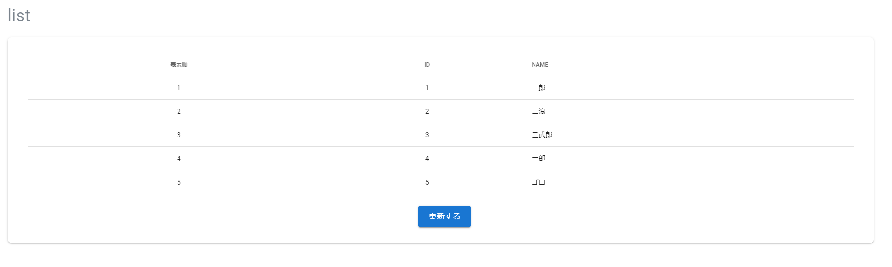

# 概要
nuxtJs環境でvuetifyの<v-simple-table>タグで作ったテーブルをドラッグアンドドロップで動かすサンプル。  

プラグインは使いません。  
v-data-tableでは動きません、というかv-data-tableでやるならプラグイン入れた方が早いと思う。  
それが出来ない/理由があってやらない方向け。  

## 開発環境
win10のローカル環境です。  
nuxtのプロジェクトを作成し```composer install```を終えて```npm run dev```でlocalhostアクセスが確認出来ている前提。
```bash
$ npm nuxt -v
6.14.15
$ node -v
v14.17.6
```
## イメージ



## 参考
大体答えが書いてあります。  
https://zukucode.com/2020/05/vue-drag-drop-order.html  
https://reffect.co.jp/vue/vue-js-table-drag-and-drop  
上記を自分の環境向けに書き直した感じです。

### ソースコード
pages/list.vue
```vue
<template>
  <v-container>
    <v-row>
      <v-col>
        <h1 class="yz-text-h1 text-h4">list</h1>
      </v-col>
    </v-row>
    <v-row>
      <v-col>
        <v-form v-model="valid" class="white py-2 px-4 rounded-lg elevation-2">
          <v-container>
            <v-container>
              <v-simple-table>
                <template #default>
                  <thead>
                  <tr>
                    <th class="text-center">
                      表示順
                    </th>
                    <th class="text-center">
                      ID
                    </th>
                    <th class="text-left">
                      NAME
                    </th>
                  </tr>
                  </thead>
                  <tbody>
                  <tr
                    v-for="(list ,index) in listDisp"
                    :key="list.id"
                    draggable="true"
                    @dragstart="dragstart(list, $event)"
                    @dragenter="dragenter(list)"
                    @dragover.stop.prevent="dragover"
                    @dragend.stop.prevent="dragend"
                  >
                    <td class="text-center">{{ index+1 }}</td>
                    <td class="text-center">{{ list.id }}</td>
                    <td>{{ list.name }}</td>
                  </tr>
                  </tbody>
                </template>
              </v-simple-table>
            </v-container>
            <v-col cols="12" class="text-center">
              <v-btn color="primary" large class="ml-4 text-body-1" @click.prevent="onApproval">更新する</v-btn>
            </v-col>
          </v-container>
        </v-form>
      </v-col>
    </v-row>
  </v-container>
</template>

<script>
    export default {
        layout: 'default',
        data () {
            return {
                valid: false,
                lists: [
                    {
                        id: 1,
                        name: '一郎',
                        order: 1,
                    },
                    {
                        id: 2,
                        name: '二浪',
                        order: 2,
                    },
                    {
                        id: 3,
                        name: '三武郎',
                        order: 3,
                    },
                    {
                        id: 4,
                        name: '士郎',
                        order: 4,
                    },
                    {
                        id: 5,
                        name: 'ゴロー',
                        order: 5,
                    },
                ],
                draggingItem: null,
            }
        },
        computed: {
            listDisp() {
                return this.lists.slice().sort((a, b) => a.order - b.order);
            },
        },
        methods: {
            dragstart(item, e) {
                this.draggingItem = item; // ドラッグ中の要素を保持
                e.dataTransfer.effectAllowed = 'move'; // 移動モードに設定
                e.target.style.opacity = 0.5; // ドラッグ中要素のスタイルを変更
            },
            dragenter(item) {
                // ドラッグ中の要素とドラッグ先の要素の表示順を入れ替える
                [item.order, this.draggingItem.order] = [this.draggingItem.order, item.order];
            },
            dragover(e) {
                e.dataTransfer.dropEffect = 'move'; // 移動モードに設定
            },
            dragend(e) {
                e.target.style.opacity = 1; // ドラッグ中要素のスタイルを変更（元に戻す）
                this.draggingItem = null; // ドラッグ中の要素をクリア
            },
            onApproval: () => {
                alert('更新しました。')
            },
        },
    }
</script>
```

## 解説
### draggable
[公式](https://developer.mozilla.org/ja/docs/Web/HTML/Global_attributes/draggable)  
ドラッグアンドロップ属性の設定を行える。

### sortで出てたエラー
もともと下記記述で進めていたが、eslintが吐いたエラーを無視するようにしていた。
```javascript
// eslint-disable-next-line vue/no-side-effects-in-computed-properties
return this.lists.sort((a, b) => a.order - b.order);
```
↓　記述で回避出来るようなので修正
```javascript
return this.lists.slice().sort((a, b) => a.order - b.order);
```
もしくは
```javascript
return Array.from(this.lists).sort((a, b) => a.order - b.order);
```
参考：https://qiita.com/mitsuhiro_K/items/f09daee3932716caf07b

### なんでv-formいるの？
順序変更した後、それをDBに保存する処理を作ろうとしている名残です。今回特に意味はありません。

### classとか
各classとかpropertyは適当にそれっぽくしてるだけなので適宜変更してください。

